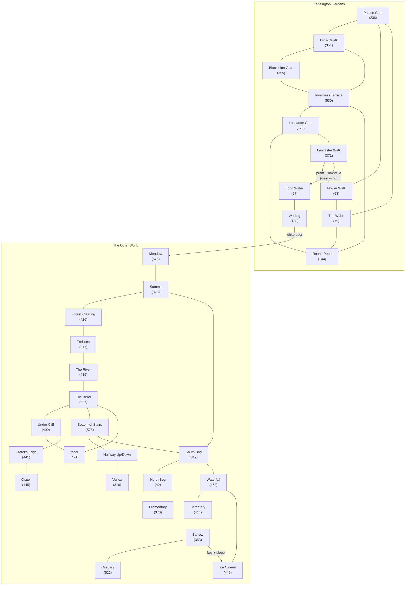

# Trinity Route Map

```mermaid
graph TD
    subgraph KG["Kensington Gardens"]
        PG["Palace Gate\n(236)"]
        BW["Broad Walk\n(354)"]
        BLG["Black Lion Gate\n(355)"]
        IT["Inverness Terrace\n(530)"]
        LG["Lancaster Gate\n(179)"]
        LWalk["Lancaster Walk\n(371)"]
        FW["Flower Walk\n(53)"]
        TW["The Wabe\n(79)"]
        RP["Round Pond\n(144)"]
        LWater["Long Water\n(97)"]
        Wading["Wading\n(438)"]
    end

    subgraph OW["The Other World"]
        Meadow["Meadow\n(576)"]
        Summit["Summit\n(323)"]
        FC["Forest Clearing\n(426)"]
        Trel["Trellises\n(317)"]
        River["The River\n(439)"]
        Bend["The Bend\n(557)"]
        Moor["Moor\n(471)"]
        BOS["Bottom of Stairs\n(575)"]
        HU["Halfway Up/Down"]
        Vertex["Vertex\n(316)"]
        SBog["South Bog\n(319)"]
        NBog["North Bog\n(42)"]
        Prom["Promontory\n(370)"]
        WF["Waterfall\n(472)"]
        Cem["Cemetery\n(414)"]
        Barrow["Barrow\n(353)"]
        Oss["Ossuary\n(522)"]
        Ice["Ice Cavern\n(449)"]
        UC["Under Cliff\n(400)"]
        CrE["Crater's Edge\n(441)"]
        Crater["Crater\n(145)"]
    end

    PG --- BW
    PG --- FW
    PG --- TW
    BW --- BLG
    BW --- IT
    BLG --- IT
    IT --- LG
    IT --- RP
    LG --- RP
    LG --- LWalk
    LWalk --- FW
    FW --- TW
    TW --- RP
    LWalk -->|"pram + umbrella\n(west wind)"| LWater
    LWater --- Wading
    Wading -->|"white door"| Meadow

    Meadow --- Summit
    Summit --- FC
    Summit --- SBog
    FC --- Trel
    Trel --- River
    River --- Bend
    Bend --- UC
    Bend --- BOS
    Bend --- Moor
    UC --- Moor
    UC --- CrE
    CrE --- Crater
    BOS --- HU
    HU --- Vertex
    BOS --- SBog
    SBog --- NBog
    SBog --- WF
    NBog --- Prom
    WF --- Cem
    WF --- Ice
    Cem --- Barrow
    Barrow --- Oss
    Barrow -->|"key + slope"| Ice
```
